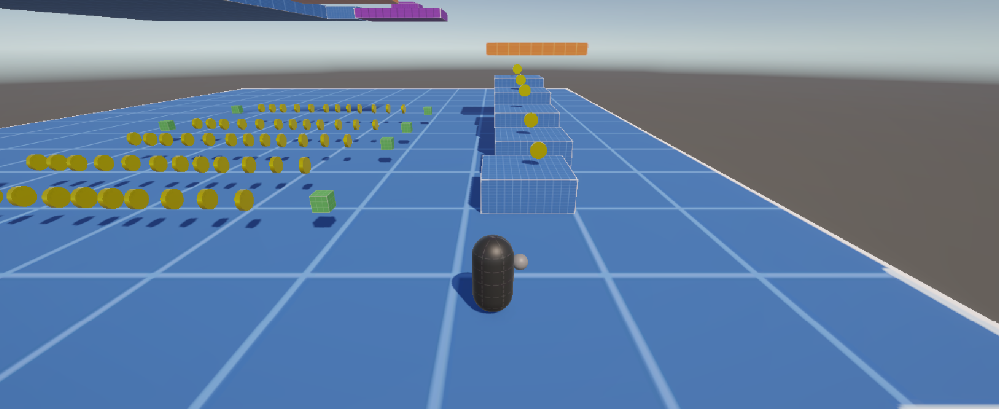
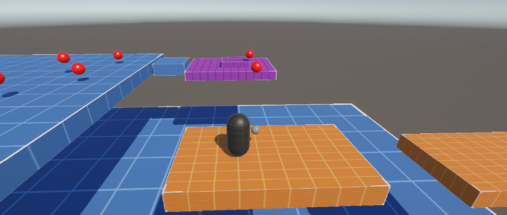
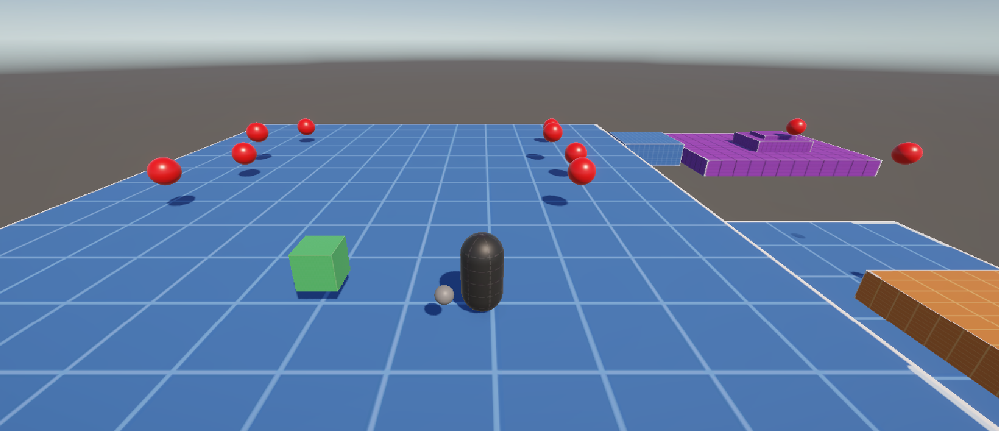

# TP1_PV_Plataform
# Prototipo 3D - Plataformas, obstaculos y transporte 

* **Alumna:** Tactaca,Cecilia Yazmin 
* **Materia:** Programación de Videojuegos 1 
* **Carrera:** Tecnicatura Universitaria en Diseño Integral de Videojuegos (TUDIVJ) — UNJu 
* **Trabajo Práctico N° 1:** Entorno Interactivo 3D, Temporizadores y Git/GitHub 
* **Equipo Docente:** Mg. Ing. Ariel Alejandro Vega | Tecn. Kevin Alexis Roman Llampa 
--- 
## 🎮 Descripción del Proyecto  

El Player (una capsula) debe recorrer el terrreno y recoger monedas, por consola se anuncia cuando recoge todas las monedas. También puede recoger in item PowerUp que acelera su movimiento por corto tiempo.
El terreno del juego tiene dos tipos de plataformas, unas fijas y otras moviles, el Player puede hacer uso de ambas. Como meta final debe llevar un cubo (Key) a una zona de meta para pasar de nivel, para ello debe atravesar un terreno con spawner que le generan daño si lo chocan, el daño se muestra por consola.

--- 

## 🕹️ Controles del Jugador 
| Acción | Tecla / Botón | Descripción | 
| :--- | :--- | :--- | 
| **Movimiento** | `W`, `A`, `S`, `D` / Flechas | Mover al personaje por el escenario | 
| **Salto** | `Espacio` | Saltar entre plataformas | 
| **Interactuar / Recolectar** | `E` / Contacto con zona(`Trigger`) | Recolectar el objeto clave o activar Power-Up | 

--- 
## 📸 Capturas de Pantalla  

*Figura 1: Layout del escenario (Greyboxing) mostrando el punto de inicio.*

*Figura 2: Zona de las plataformas móviles.*

*Figura 3: Zona de spawn y la zona de meta.*
--- 
## ⚙️ Mecánicas Implementadas

1. **Control de Personaje (3D Movement):** Movimiento fluido en tercera persona con detección de suelo y capacidad de salto mediante.
2. **Plataformas Móviles:** Plataformas con movimiento oscilatorio continuo (horizontal/vertical) que arrastran al personaje de forma suave al pararse sobre ellas.
3. **Generador Periódico de Obstáculos (Spawner):** Punto de generación que instancia obstáculos con física a intervalos regulares de tiempo para dificultar el paso.
4. **Potenciador Temporal (Power-Up):** Consumible que otorga un incremento temporal de velocidad durante un tiempo determinado (ej. 5 segundos) al entrar en contacto.
5. **Sistema de Recolección y Meta:** 
   - Mecánica para recoger el objeto objetivo al colisionar con él y presionar la tecla E.
   - Lógica de transporte vinculada al personaje.
   - Zona de meta (*Trigger*) que valida la posesión del objeto antes de activar la condición de victoria.
---
## 🛠️ Versión de Unity
* **Unity 6 LTS** (Versión utilizada: `6000.5.8f1`)
* **Pipeline de Renderizado:** Universal Render Pipeline (URP) *
---
